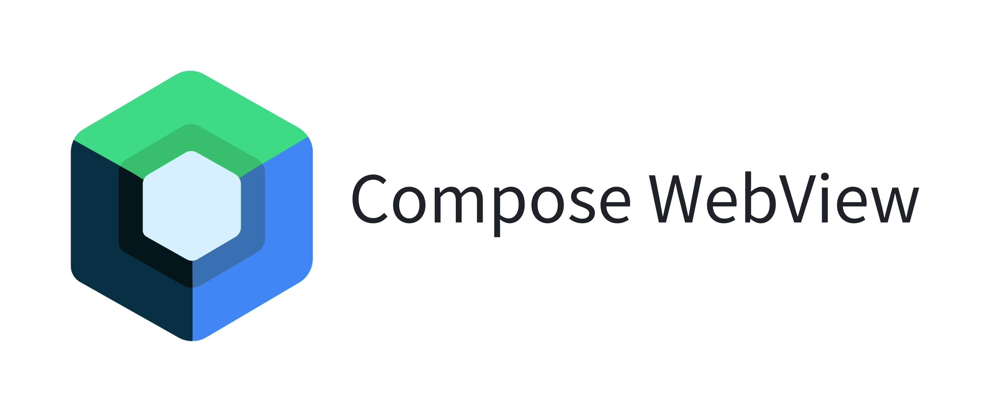

# WebView wrapper for Jetpack Compose

[](https://jitpack.io/#KevinnZou/compose-webview)
[](https://search.maven.org/artifact/io.github.kevinnzou/compose-webview)




According to the [official documentation](https://medium.com/androiddevelopers/an-update-on-jetpack-compose-accompanist-libraries-august-2023-ac4cbbf059f1) updated on August 2023,
Jetpack Compose Accompanist library decided to deprecate the Web library with no replacement.

However, as a contributor to this library, I am still relying on it to provide WebView support in my App. Thus, I decided to fork that library and make future updates on it.
This is a fork of the original library with the latest version 0.33.1-alpha.

For more information, visit the documentation: https://google.github.io/accompanist/web/

## Basic Usage

To implement this wrapper there are two key APIs which are needed: WebView, which provides the layout, and rememberWebViewState(url) which provides some remembered state including the URL to display.

The basic usage is as follows:
```kotlin
val state = rememberWebViewState("https://example.com")

WebView(state)
```
This will display a WebView in your Compose layout that shows the URL provided.

There is a larger sample in the sample app which can be found [here](https://github.com/KevinnZou/compose-webview/blob/main/app/src/main/java/com/kevinnzou/webview/sample/BasicWebViewSample.kt). This sample also shows how to show a loading state.

## State
This library provides a [WebViewState](https://github.com/KevinnZou/compose-webview/blob/main/web/src/main/java/com/kevinnzou/web/WebViewState.kt) class as a state holder to hold the state for the WebView.

```kotlin
class WebViewState(webContent: WebContent) {
    var lastLoadedUrl: String? by mutableStateOf(null)
        internal set

    /**
     *  The content being loaded by the WebView
     */
    var content: WebContent by mutableStateOf(webContent)

    /**
     * Whether the WebView is currently [LoadingState.Loading] data in its main frame (along with
     * progress) or the data loading has [LoadingState.Finished]. See [LoadingState]
     */
    var loadingState: LoadingState by mutableStateOf(LoadingState.Initializing)
        internal set

    /**
     * Whether the webview is currently loading data in its main frame
     */
    val isLoading: Boolean
        get() = loadingState !is LoadingState.Finished

    /**
     * The title received from the loaded content of the current page
     */
    var pageTitle: String? by mutableStateOf(null)
        internal set

    /**
     * A list for errors captured in the last load. Reset when a new page is loaded.
     * Errors could be from any resource (iframe, image, etc.), not just for the main page.
     * For more fine grained control use the OnError callback of the WebView.
     */
    val errorsForCurrentRequest: SnapshotStateList<WebViewError> = mutableStateListOf()


    // We need access to this in the state saver. An internal DisposableEffect or AndroidView
    // onDestroy is called after the state saver and so can't be used.
    internal var webView by mutableStateOf<IWebView?>(null)
}
```

It can be created using the [rememberWebViewState](https://github.com/KevinnZou/compose-webview/blob/3e8c4a21967dfd258b870034117a01f8d6976a2a/web/src/main/java/com/kevinnzou/web/WebViewStateExt.kt#L20) function, which can be remembered across Compositions.

```kotlin
val state = rememberWebViewState("https://github.com/KevinnZou/compose-webview-multiplatform")

/**
 * Creates a WebView state that is remembered across Compositions.
 *
 * @param url The url to load in the WebView
 * @param additionalHttpHeaders Optional, additional HTTP headers that are passed to [WebView.loadUrl].
 *                              Note that these headers are used for all subsequent requests of the WebView.
 */
@Composable
fun rememberWebViewState(
    url: String,
    additionalHttpHeaders: Map<String, String> = emptyMap()
)

/**
 * Creates a WebView state that is remembered across Compositions.
 *
 * @param data The uri to load in the WebView
 * @param baseUrl The URL to use as the page's base URL.
 * @param encoding The encoding of the data in the string.
 * @param mimeType The MIME type of the data in the string.
 * @param historyUrl The history URL for the loaded HTML. Leave null to use about:blank.
 */
@Composable
fun rememberWebViewStateWithHTMLData(
  data: String,
  baseUrl: String? = null,
  encoding: String = "utf-8",
  mimeType: String? = null,
  historyUrl: String? = null
)

```

Developers can use the `WebViewState` to get the loading information of the WebView, such as the loading progress, the loading status, and the URL of the current page.
```kotlin
Column {
    val state = rememberWebViewState("https://github.com/KevinnZou/compose-webview")

    Text(text = "${state.pageTitle}")
    val loadingState = state.loadingState
    if (loadingState is LoadingState.Loading) {
        LinearProgressIndicator(
            progress = loadingState.progress,
            modifier = Modifier.fillMaxWidth()
        )
    }
    WebView(
        state
    )
}
```

## Navigation
This library provides a [WebViewNavigator](https://github.com/KevinnZou/compose-webview/blob/main/web/src/main/java/com/kevinnzou/web/WebViewNavigator.kt) class 
to control over the navigation of a WebView from outside the composable. 

E.g.for performing a back navigation in response to the user clicking the "up" button in a TopAppBar.

It can be used to load a new URL, evaluate the JavaScript, and go back and forward in the history.

```kotlin
class WebViewNavigator(private val coroutineScope: CoroutineScope) {

    /**
     * True when the web view is able to navigate backwards, false otherwise.
     */
    var canGoBack: Boolean by mutableStateOf(false)
        internal set

    /**
     * True when the web view is able to navigate forwards, false otherwise.
     */
    var canGoForward: Boolean by mutableStateOf(false)
        internal set

    fun loadUrl(url: String, additionalHttpHeaders: Map<String, String> = emptyMap()) {}

    fun loadHtml(
        html: String,
        baseUrl: String? = null,
        mimeType: String? = null,
        encoding: String? = "utf-8",
        historyUrl: String? = null
    ) {
    }

    fun postUrl(
        url: String,
        postData: ByteArray
    ) {
    }

    fun evaluateJavaScript(script: String, callback: ((String) -> Unit)? = null)

    /**
     * Navigates the webview back to the previous page.
     */
    fun navigateBack() {}

    /**
     * Navigates the webview forward after going back from a page.
     */
    fun navigateForward() {}

    /**
     * Reloads the current page in the webview.
     */
    fun reload() {}

    /**
     * Stops the current page load (if one is loading).
     */
    fun stopLoading() {}
}
```

It can be created using the [rememberWebViewNavigator](https://github.com/KevinnZou/compose-webview/blob/3e8c4a21967dfd258b870034117a01f8d6976a2a/web/src/main/java/com/kevinnzou/web/WebViewNavigator.kt#L190) function, which can be remembered across Compositions.

```kotlin
val navigator = rememberWebViewNavigator()

@Composable
fun rememberWebViewNavigator(
    coroutineScope: CoroutineScope = rememberCoroutineScope()
): WebViewNavigator = remember(coroutineScope) { WebViewNavigator(coroutineScope) }
```

Developers can use the *WebViewNavigator* to control the navigation of the WebView.
```kotlin
val navigator = rememberWebViewNavigator()

Column {
    val state = rememberWebViewState("https://example.com")
    val navigator = rememberWebViewNavigator()

    TopAppBar(
        title = { Text(text = "WebView Sample") },
        navigationIcon = {
            if (navigator.canGoBack) {
                IconButton(onClick = { navigator.navigateBack() }) {
                    Icon(
                        imageVector = Icons.Default.ArrowBack,
                        contentDescription = "Back"
                    )
                }
            }
        }
    )
    Text(text = "${state.pageTitle}")
    val loadingState = state.loadingState
    if (loadingState is LoadingState.Loading) {
        LinearProgressIndicator(
          progress = loadingState.progress,
          modifier = Modifier.fillMaxWidth()
        )
    }
  WebView(
    state = state,
    navigator = navigator
  )
}
```


## WebView settings including JavaScript

By default, JavaScript is disabled in the WebView. To enable it or any other settings you can use the onCreated callback.
```kotlin
WebView(
    state = webViewState,
    onCreated = { it.settings.javaScriptEnabled = true }
)
```

## Capturing back presses
By default, the WebView will capture back presses/swipes when relevant and navigate the WebView back. This can be disabled via the parameter on the Composable.
```kotlin
WebView(
    ...
    captureBackPresses = false
)
```

## Using a subclass of WebView
If you want to use a subclass of WebView, or simply require more control over its instantiation, you can provide a factory.
```kotlin
WebView(
    ...
    factory = { context -> CustomWebView(context) }
)
```

## Download

[](https://search.maven.org/artifact/io.github.kevinnzou/compose-webview)

```groovy
repositories {
    mavenCentral()
}

dependencies {
    implementation "io.github.kevinnzou:compose-webview:0.33.6"
}
```

# License
Compose WebView is distributed under the terms of the Apache License (Version 2.0). See the [license](https://github.com/KevinnZou/compose-webview/blob/dev/LICENSE) for more information.

